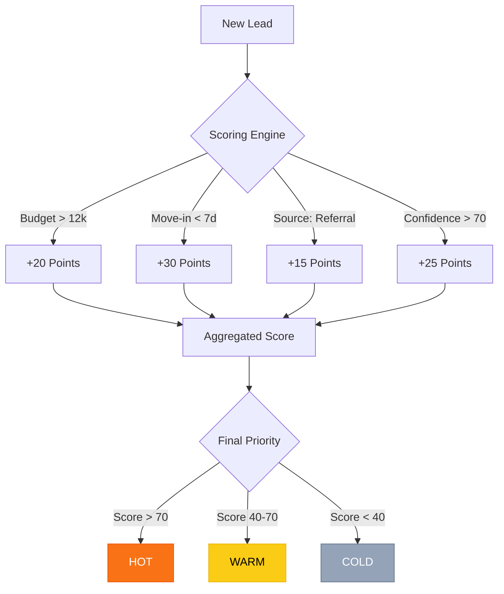
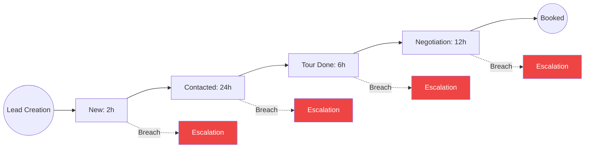
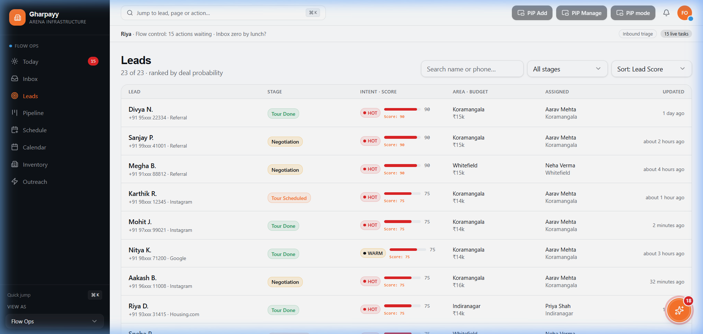
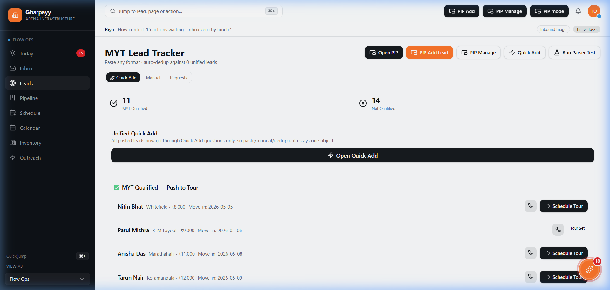

# Internship Assignment: CRM Logic Finalization

**Project**: Gharpayy Lead Management CRM MVP  
**Candidate**: Internship Finalization Phase  
**Focus**: Core Business Logic, SLA Enforcement, and Dedicated UX.

---

## 🎯 Assignment Objective
The goal was to transition the Gharpayy CRM from a "visual mockup" to a "data-driven MVP" by implementing the exact business rules provided in the brief. This included lead scoring, SLA clocks, and moving lead management from simple drawers to dedicated, URL-addressable pages.

## 🛠 Features Implemented

### 1. The Lead Scoring Algorithm (`scoring.ts`)
I replaced placeholder random numbers with a deterministic weighted scoring engine.
- **Rules**:
  - `Budget > 12,000`: +20 points.
  - `Move-in < 7 days`: +30 points.
  - `Source = Referral`: +15 points.
  - `Confidence > 70`: +25 points.
- **Workflow Diagram**:

### 2. SLA & Overdue Enforcement (`overdue.ts`)
Implemented state-specific SLA clocks to ensure no lead goes unattended. 
**SLA Lifecycle Workflow**:

- **Thresholds**:
  - `New`: 2 Hours
  - `Contacted`: 24 Hours
  - `Tour Done`: 6 Hours
  - `Negotiation`: 12 Hours
- **UI Integration**: Leads show a `[Xh SLA]` badge. If breached, an "SLA Breach" alert pulses on the card, and the card appears in the "Overdue Only" filtered view.

### 3. Pipeline & Dashboard Integration
- **Kanban Sorting**: The Pipeline now automatically sorts leads within each column by their calculated score (Hot leads at the top).
- **Overdue Filter**: Added a global toggle to the Pipeline to isolate breached SLAs.
- **Hot Pipeline**: Updated the Dashboard's "Hot Pipeline" section to use the live scoring engine instead of mock intent.

### 4. Dedicated Lead Pages (`leads.$leadId.tsx`)
Refactored the lead management UX from a side-drawer into a fully functional dedicated page.
- **URL-Addressable**: Managers can now share links to specific leads (e.g., `/leads/l-5`).
- **Full-Page Control**: The `LeadDetailView` was refactored to expand into a full-page layout while maintaining the same powerful controls as the drawer.

## 📸 Screenshots

### Pipeline with SLA Badges

*Shows leads sorted by score with active SLA clocks.*

### Dedicated Lead Page

*The full management interface for a specific lead.*

## 🧪 Verification & Persistence
- **Persistence**: Verified that all updates (Stage changes, notes, etc.) are saved to LocalStorage via Zustand's `persist` middleware.
- **Logic Accuracy**: Verified that high-budget, urgent referral leads correctly jump to the top of the "Hot" list.

---

### **How to Verify**
1. Navigate to the **Pipeline**.
2. Note the score on **Karthik R.** (75).
3. Toggle **"Overdue Only"** to see leads that have breached their stage-specific SLA.
4. Click on a lead to visit their **Dedicated Detail Page**.
