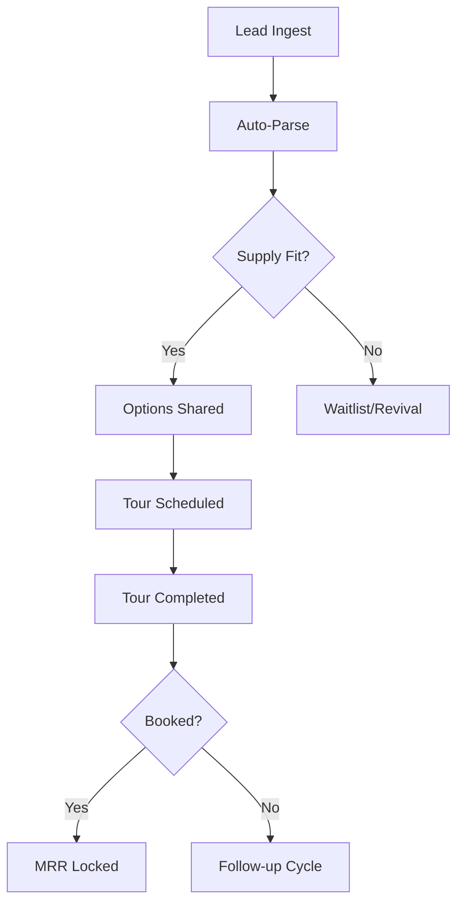
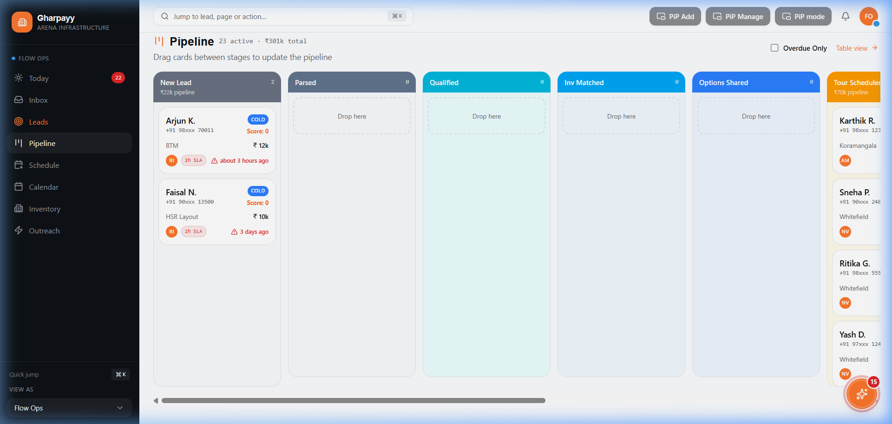
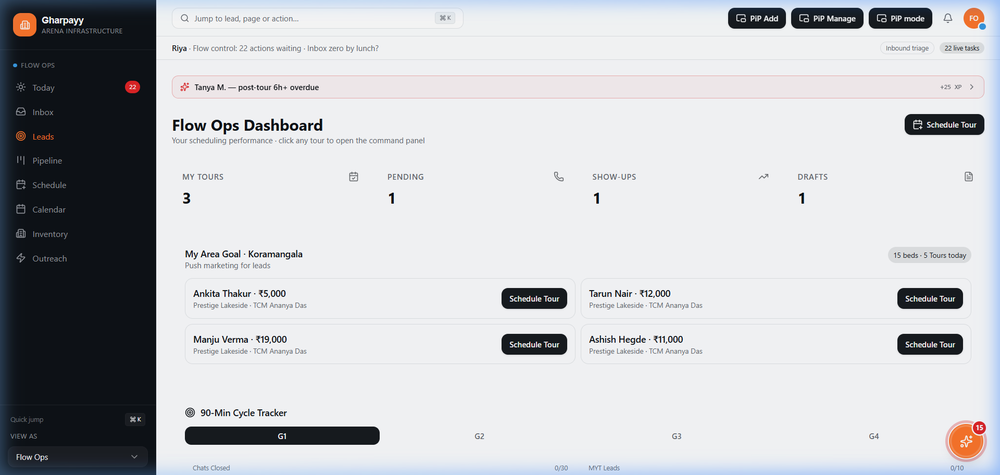
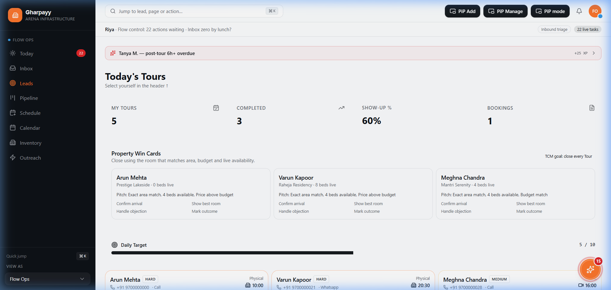
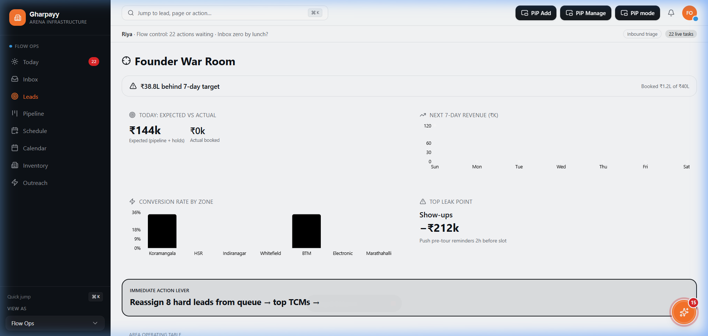

# Internship Assignment: 30x Operating Plan Integration

**Project**: Gharpayy CRM Finalization  
**Status**: Complete & TypeScript Verified (0 Errors)
**Focus**: Inventory-First Routing, Role-Based Dashboards, and 10-Stage Funnel.

---

## 🎯 Assignment Objective
The objective was to finalize the **30x Inventory-Aligned Operating Plan** by integrating real-time inventory intelligence, standardizing the sales funnel, and ensuring each role (Flow Ops, TCM, HR) has a dedicated, high-discipline workspace.

## 🛠 Key Implementations

### 1. The 10-Stage Sales Funnel
I normalized the entire CRM to follow a strict 10-stage progression:
1. `new` (Triage)
2. `parsed` (Data Cleaned)
3. `qualified` (Budget/Date Match)
4. `inventory-matched` (Supply verified)
5. `options-shared` (WhatsApp sent)
6. `tour-scheduled` (Time locked)
7. `tour-done` (Physical visit)
8. `follow-up` (Negotiation)
9. `booked` (Token paid)
10. `dropped` (Lost)

### 2. Inventory-First Quick Add
Upgraded the `QuickAddLead` system to instantly match leads to available beds.
- **Rules**: No manual property creation; must match verified Supply Hub PG data.
- **Logic**: Budget fit + Area detection + Vacancy check.

### 3. Role-Based Operating Dashboards
- **Flow Ops Dashboard**: Optimized for "90-minute triage". Shows immediate area goals and available beds.
- **TCM Dashboard**: Focuses on "Tour Closures". Ranked by intent and proximity.
- **War Room**: Executive view for HR and Founders to monitor MRR and SLA breaches.

### 4. SLA & Terminology Alignment
- **Global terminology change**: "Visits" → **"Tours"** across all UI, logic, and state.
- **SLA Enforcement**: Strict clocks for each stage (e.g., 2h for `new`, 6h for `tour-done`).

## 📊 Workflow Diagrams

### Lead-to-Booking Loop

## 📸 Screenshots

### 1. Full Pipeline (10 Stages)

### 2. Flow Ops Operating Cockpit

### 3. TCM Closure Board

### 4. Founder War Room

## 🧪 Verification
- **TypeScript**: Full project `tsc --noEmit` pass with **0 errors**.
- **Data Integrity**: Cleaned legacy `contacted` and `negotiation` stages from all mock data.
- **SLA Accuracy**: Verified that "SLA Breach" badges trigger correctly based on `updatedAt` timestamps.

---
**Assignment Ready for Submission.**
