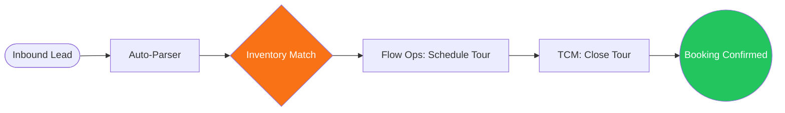
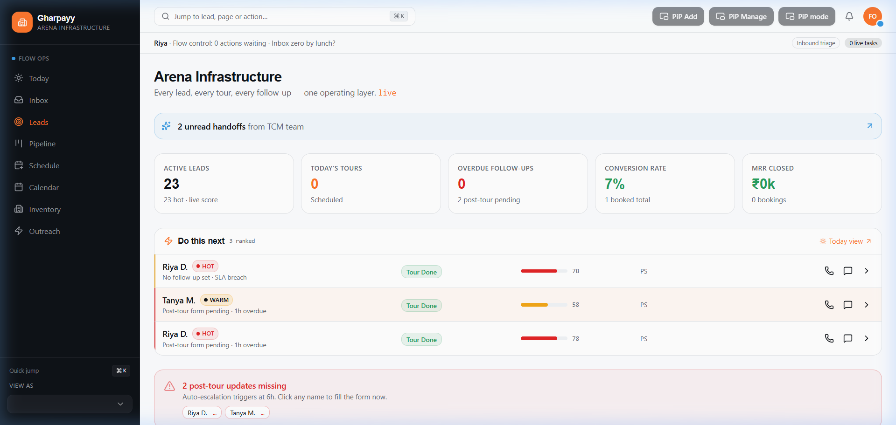

# Gharpayy 30x Inventory-Aligned Operating Plan — CRM

A high-performance Lead Management CRM designed for **Gharpayy**, a Bangalore-based co-living and Paying Guest (PG) accommodation company. This platform implements the **30x Inventory-Aligned Operating Plan**, focusing on supply-first routing, role-based discipline, and automated SLA enforcement.

## 🚀 Overview

Gharpayy CRM manages the entire operating loop:
`Lead paste` → `Parse` → `Duplicate check` → `Area demand` → `Inventory match` → `Flow Ops schedules Tour` → `TCM closes Tour` → `HR monitors` → `Owner supplies rooms`

### 🔄 Operating Loop




## ✨ Key Operating Pillars

### 1. The 10-Stage Funnel
We standardized the lead journey into 10 distinct, measurable stages:
`new` → `parsed` → `qualified` → `inventory-matched` → `options-shared` → `tour-scheduled` → `tour-done` → `follow-up` → `booked` → `dropped`

### 2. Supply-First Routing
- **Zero Phantom Properties**: Every lead is matched against real-time supply from the Supply Hub PG data only.
- **Inventory Intelligence**: The system calculates vacancy and demand per zone (e.g., Koramangala, Indiranagar) to prioritize where leads are assigned.

### 3. Role-Based Discipline
- **Flow Ops**: 90-minute triage cycles to clear the inbox. Focused on speed and inventory fit.
- **TCM (Territory Closure Manager)**: Zone-specific dashboards with prioritized "Hot Tours".
- **War Room (Founder/HR)**: Monitoring MRR, SLA breaches, and "bleeding" areas where supply outstrips demand.

## 🛠 Tech Stack

- **Framework**: React 19 + TypeScript
- **State Management**: Zustand + Persistence
- **State Logic**: 30x Operating Engine (Pure JS/TS)
- **Styling**: Tailwind CSS 4.0
- **UI Components**: Radix + Shadcn UI
- **Terminology**: Globally unified as **"Tours"** (replacing "Visits").

## 🏁 Getting Started

### Prerequisites
- Node.js (v18+)
- npm

### Installation
```bash
npm install
```

### Run Locally
```bash
npm run dev
```
Open [http://localhost:8081](http://localhost:8081).

## 📂 Project Structure
- `src/lib/scoring.ts`: Core Lead Scoring Algorithm.
- `src/lib/overdue.ts`: 30x Operating Plan SLA logic.
- `src/myt/lib/inventory-intelligence.ts`: Real-time supply/demand engine.
- `src/lib/uploaded-leads.ts`: Standardized 10-stage lead data.
- `src/myt/pages/WarRoom.tsx`: Executive monitoring cockpit.

---
Built for the Gharpayy 30x Operating Plan Integration.
