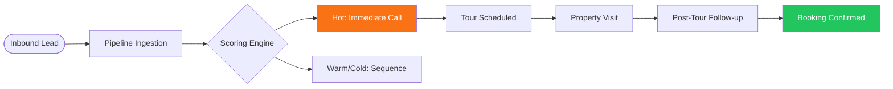

# Gharpayy Lead Management CRM — MVP

A high-performance Lead Management CRM designed for **Gharpayy**, a Bangalore-based co-living and Paying Guest (PG) accommodation company. This platform enables sales teams to manage inbound leads, track tour schedules, and convert prospects into residents through data-driven scoring and SLA enforcement.

## 🚀 Overview

Gharpayy CRM streamlines the journey from lead acquisition (Instagram, Google, Referrals) to booking. It provides sales managers and TCMs (Tour & Conversion Managers) with a real-time view of their pipeline, ranked by deal probability.

### 🔄 Lead Lifecycle Workflow



## 🛠 Tech Stack

- **Framework**: React 19 + TypeScript
- **Routing & SSR**: TanStack Start (Router + File-based routing)
- **State Management**: Zustand + Persistence (LocalStorage)
- **Styling**: Tailwind CSS 4.0
- **UI Components**: Shadcn UI (Radix)
- **Drag & Drop**: @dnd-kit
- **Date Management**: date-fns

## ✨ Core Features

### 📊 Intelligent Pipeline (Kanban)
- **Score-Based Sorting**: Leads in each column are automatically ranked by their calculated probability score.
- **SLA Enforcement**: Real-time clocks show hours remaining before an SLA breach (e.g., 2h for New leads).
- **Overdue Filtering**: One-click toggle to focus only on leads requiring immediate attention.

### 🎯 Lead Scoring Engine
Leads are dynamically ranked (0-100) based on:
- **Budget**: High-value leads (+20)
- **Urgency**: Move-in within 7 days (+30)
- **Source**: Referral leads (+15)
- **Confidence**: Manual sales assessment (+25)

### 📄 Dedicated Lead Management
Each lead has a URL-addressable dedicated page (`/leads/$leadId`) containing:
- **Lead Dossier**: Detailed preferences and history.
- **Control Panel**: Stage transitions, template messaging, and sequence triggers.
- **Tour Scheduling**: Integrated booking and post-tour outcome tracking.
- **Handoff Threads**: Collaboration between FlowOps and TCMs.

## 🏁 Getting Started

### Prerequisites
- Node.js (v18+)
- npm or bun

### Installation
```bash
cd ops1g
npm install
```

### Run Locally
```bash
npm run dev
```
Open [http://localhost:8081](http://localhost:8081) in your browser.

## 📂 Project Structure
- `src/lib/scoring.ts`: Core Lead Scoring Algorithm.
- `src/lib/overdue.ts`: SLA and Overdue calculation logic.
- `src/routes/`: File-based routing (Pipeline, Leads, Dashboard).
- `src/components/`: Reusable UI modules (Kanban, Control Panel, Atoms).
- `src/lib/store.ts`: Global state management with Zustand.

---
Built for the Gharpayy Internship Assignment.
